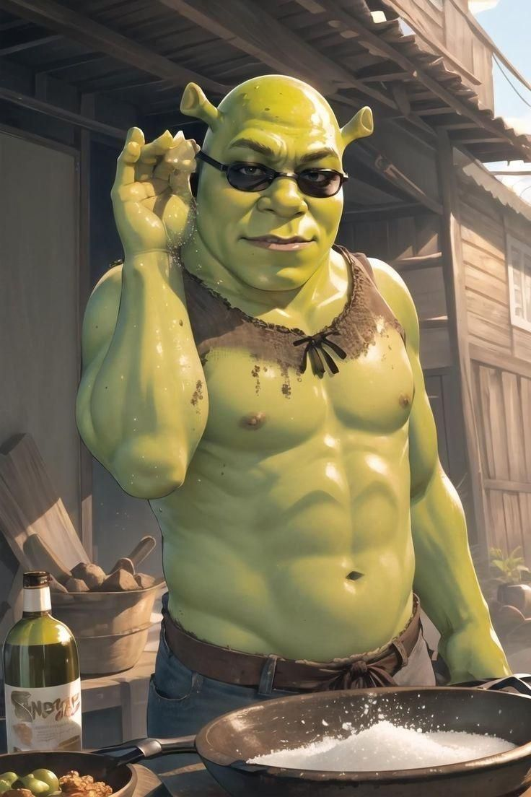

# 🐸 Sky Runner Shrek

Um jogo de corrida infinita com o icônico Shrek! Pule os obstáculos, alcance 10 pontos e vença. Feito com HTML5, CSS3 e JavaScript puro.

---

## 🎮 Como Jogar

- **Toque** ou **clique** na tela para pular.
- Evite os obstáculos (Lorde Farquaad e Príncipe Encantado).
- Faça **10 pontos** para vencer!
- Se bater, verá a tela de **Game Over** e poderá reiniciar.

---

## 🚀 Como Executar o Jogo

1. Clone este repositório ou baixe o `.zip`
2. Coloque os seguintes arquivos na mesma pasta:
   - `index.html`
   - `sherek.png`
   - `sherek2.jpg`
   - `fundo.jpg`
   - `prince.webp`
   - `lorde.webp`
   - `musica1.mp3`
3. Abra o `index.html` no navegador (preferencialmente no Chrome ou Firefox)

> ✅ Totalmente jogável em dispositivos **mobile** e **desktop**.

---

## 🛠️ Tecnologias Utilizadas

- HTML5 `<canvas>`
- CSS3 (com botões estilizados e responsivos)
- JavaScript puro (sem bibliotecas externas)

---

## 📱 Otimizado para Mobile

- Design responsivo
- Toques ativam pulo
- Música começa com a interação
- Gravidade, pulo e velocidade calibrados para telas pequenas

---

## 🖼️ Créditos e Assets

- Personagem: **Shrek** (DreamWorks)
- Imagens e sons são de uso pessoal/demonstração.
- Música: `musica1.mp3`

---

## 📦 Melhorias Futuras

- Sistema de níveis (fases)
- Obstáculos com movimento
- Ranking de pontuação
- Power-ups (escudo, super pulo etc.)

---

## 📧 Contato

Criado por Vitor Girotto  
Se quiser colaborar ou reportar bugs, fique à vontade para abrir uma *issue* ou *pull request*.

